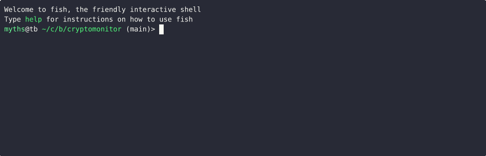

# How to use

1. Make sure you have installed rust https://doc.rust-lang.org/cargo/getting-started/installation.html

2. Clone this project

3. Add alchemy api key to .env

```bash
mv .env.default .env
vim .env
```

4. Build
   
```bash
cargo build -p cli
mv ./target/release/cli .
./cli --help
```

5. Monitor

Monior swaps in the 100 pending txs
```bash
./cli -c 100 swap
```

Monior new pairs in the 100 pending txs
```bash
./cli -c 100 pair
```

Monior token transfers
```bash
./cli -c 100 token
```


Monitor token price
```bash
./cli price -t btc,eth,sol
```

# Test

There are some other functions under development
```
cargo run --example deploy_erc20 -p core
```

# Functions

- [x] Monitor swaps: Uniswap(Ethereum), SushiSwap(Ethereum)
- [x] Monitor token transfer: USDT, USDC, PEPE(Ethereum)
- [x] Monitor new pair: Uniswap(Ethereum), SuiShiSwap(Ethereum)
- [ ] Monitor new pair: PancakeSwap(BSC)
- [x] Monitor new pair for Base network
- [ ] Monitor new pair for Raydium, Orca on Solana
- [ ] Monitor creating nft or order on OpenSea, Blur
- [ ] Monitor target wallet's txs
- [ ] Monitor token price
- [ ] Monitor token volume
- [ ] Frontend UI